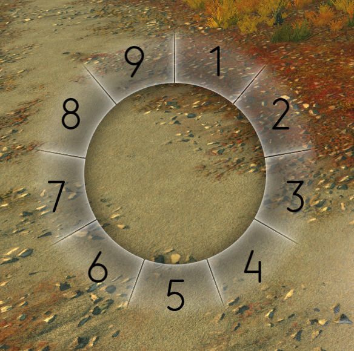

# Radial Menus Builds
A [Radial Menus](https://github.com/RaidcoreGG/GW2-RadialMenus) pack.

## General
A simple pack to change your Build and Equipment Template to the selected one in one go.

## Installation
Download the [latest version](https://github.com/CaptainZlick/gw2-radial-menus-builds/releases/latest) and extract it inside the `<Guild Wars 2>\addons\RadialMenus` directory.

## Known issues
* Build and Equipment Template 9 is not implemented yet
